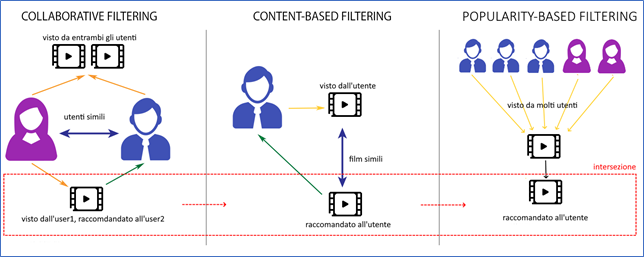
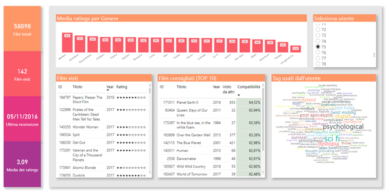
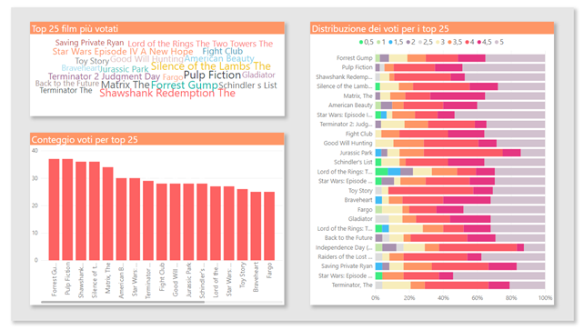
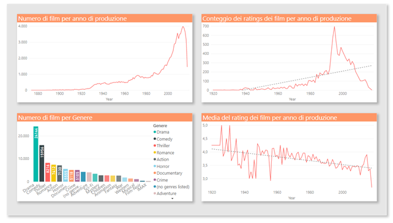
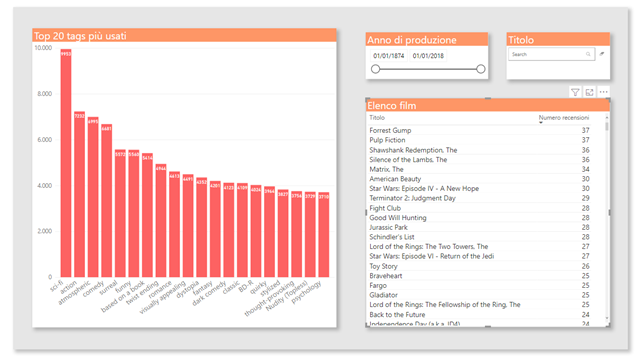
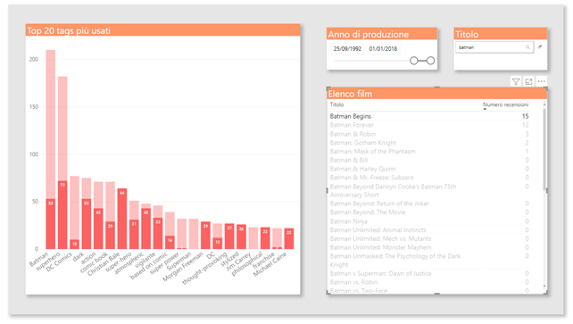
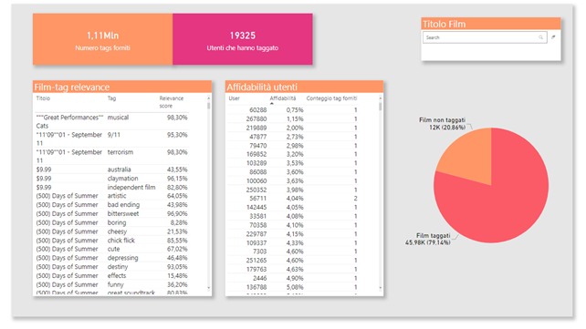

# Movielens Reccomendation System
Movies reccomendation system based on big data analysis (using Spark, MongoDB and PowerBI)

# Project description
This repo contains a set of Jupyter Notebooks that implement a movie reccomendation system for the MovieLens 20M dataset. 
The dataset contains 27M anonymous ratings of approximately 58K movies.

The proposed architecture makes use of collaborative filtering, content-based and popularity-based approaches

 

- Collaborative filtering: using ALS, the list of all films still not seen is provided, in order of user compatibility.
- Content-based filtering: filter the previous results based on the top 5 genres preferred by the user.
- Popularity-based filtering: filter films seen less than 30 times from previous results.

In addition to the results of the recommendations, some interesting analytics on the dataset are shown via dashboards.

 

 

 

 

 

 
